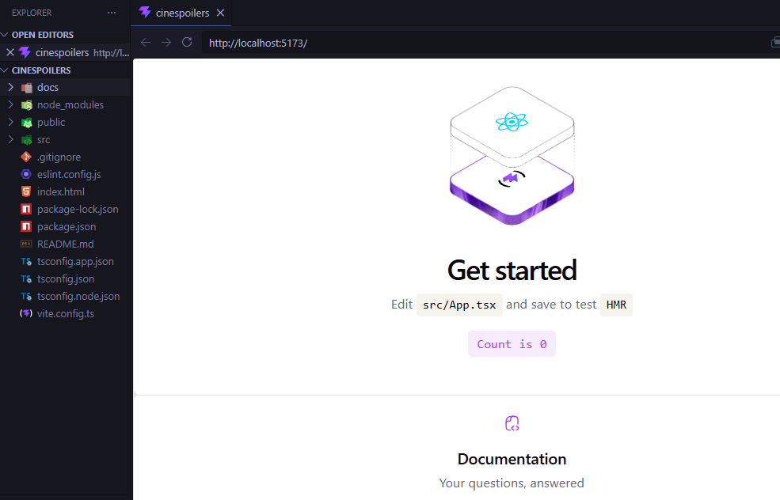
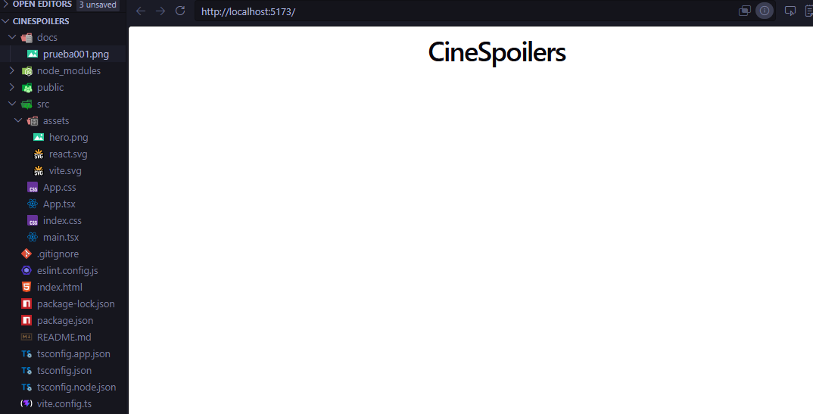
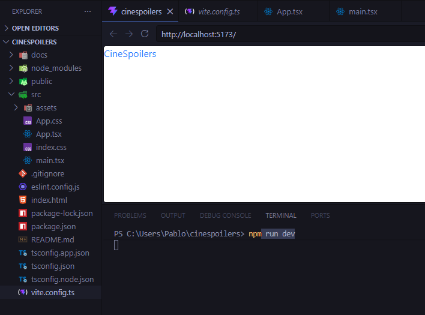
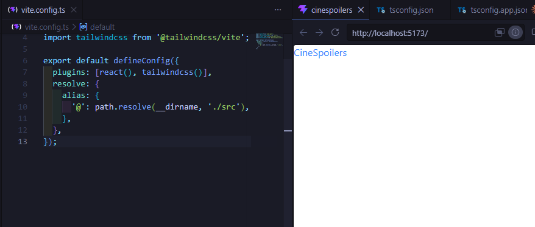
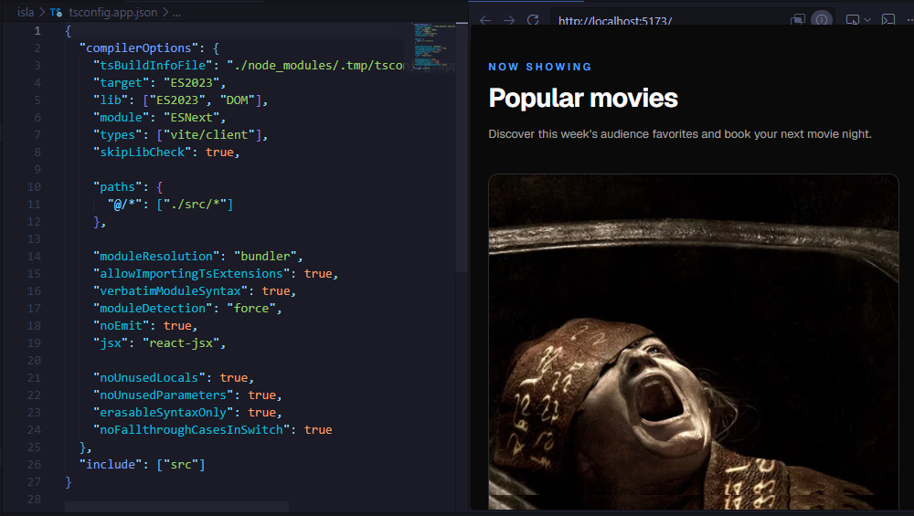
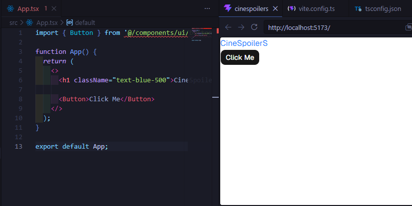
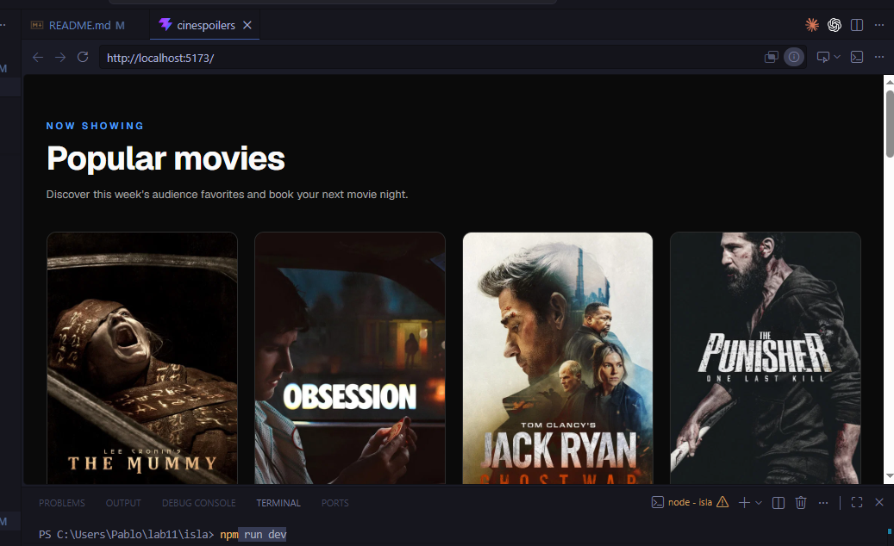

## Autor 
# Piero Huaytalla

## Evidencia 1 

## Evidencia 2 

## Evidencia 3 

## Evidencia 4 

## Evidencia 5

## Evidencia 6

## Evidencia 7

## Autor 
# Andy Campos

## Evidencia 1: Consumir endpoinst y renderizar información

## Evidencia 2: Limpiar proyecto

## Evidencia 3: Instalar tailwind

## Evidencia 4: configurar alias - -Instalar shadcn

## Evidencia 5: Configurar shadcn - Feching de datos

## Evidencia 6:Instalar y configurar axios -Mostrar por consola

## Evidencia 7: Renderizado de información

## Autor 
# Pablo Isla

## Evidencia 1: Consumir endpoinst y renderizar información

## Evidencia 2: Limpiar proyecto

## Evidencia 3: Instalar tailwind

## Evidencia 4: configurar alias - -Instalar shadcn

## Evidencia 5: Configurar shadcn - Feching de datos

## Evidencia 6:Instalar y configurar axios -Mostrar por consola

## Evidencia 7: Renderizado de información

